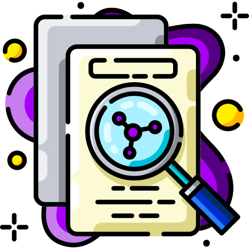

# 📄 Next AI Paper 

<div align="center">
  
  <h3>Beam search your next AI paper idea</h3>
  <p><i>Discover groundbreaking research directions tailored to your resources and expertise</i></p>
</div>

---

## 🚀 Overview

**Next AI Paper** is a powerful Streamlit application designed to help AI researchers identify promising research directions based on the latest publications from arXiv. The application leverages Claude AI to generate detailed, hardware-aware research ideas tailored to your computational resources and expertise level.

## ✨ Key Features

- **📚 Smart Paper Selection**: Search and browse hundreds of recent papers by topic or conference
- **🔍 Interactive Paper Exploration**: Select the most relevant papers to inspire your research
- **💡 Tailored Research Ideas**: Generate novel research ideas customized to your specific hardware setup
- **⚙️ Hardware-Aware Suggestions**: Specify your GPU resources, time constraints, and expertise level
- **📝 Comprehensive Output**: Get detailed methodology, implementation guidance, and challenge analysis
- **💾 Export Options**: Download generated research ideas in both Markdown and plain text formats

## 🌐 Public Access

Access the application directly online at: 
[https://nextaipaper.streamlit.app](https://nextaipaper.streamlit.app)

No installation required - just bring your Claude API key!

## 🛠️ Local Installation

If you prefer to run the application locally:

```bash
# Clone the repository
git clone https://github.com/yourusername/next-paper.git
cd next-paper

# Install required dependencies
pip install -r requirements.txt

# Launch the application
streamlit run main.py
```

## 🔧 Requirements

- Python 3.7+
- Streamlit 1.31.0+
- Anthropic Claude API key
- Internet connection for arXiv access

### 🔑 Getting a Claude API Key

To use Next AI Paper, you'll need a Claude API key:

1. Sign up for [Anthropic's Claude API](https://www.anthropic.com/product)
2. Create an API key in your dashboard
3. Copy your API key and use it in the application
4. **Note**: API usage may incur charges based on Anthropic's pricing

## 🧩 How It Works

<div align="center">
  <table>
    <tr>
      <td align="center"><b>Search</b></td>
      <td align="center"><b>Select</b></td>
      <td align="center"><b>Generate</b></td>
    </tr>
    <tr>
      <td>Find the latest papers on your research topic</td>
      <td>Choose up to 10 papers that interest you</td>
      <td>Get AI-generated research ideas based on your selection</td>
    </tr>
  </table>
</div>

## 💻 Resource-Aware Research Ideas

Specify your computational environment to get feasible research directions:

- **GPU Configuration**: Type, count, and memory
- **Time Constraints**: Project timeline expectations
- **Expertise Level**: Coding and research experience
- **Team Structure**: Solo researcher or team size

## 📊 Workflow

1. **Configure**: Enter your Claude API key and researcher profile
2. **Search**: Retrieve papers by topic or conference
3. **Refine**: Filter and select the most relevant papers
4. **Customize**: Set your hardware specifications and constraints
5. **Generate**: Get detailed, resource-aware research ideas
6. **Export**: Download your research roadmap in your preferred format

## 🔒 Privacy

- Your Claude API key is only used during the current session
- No data is stored on our servers
- All processing happens in your local environment

## 📜 License

MIT

---

<div align="center">
  <p>Built with ❤️ for the AI research community</p>
</div>
